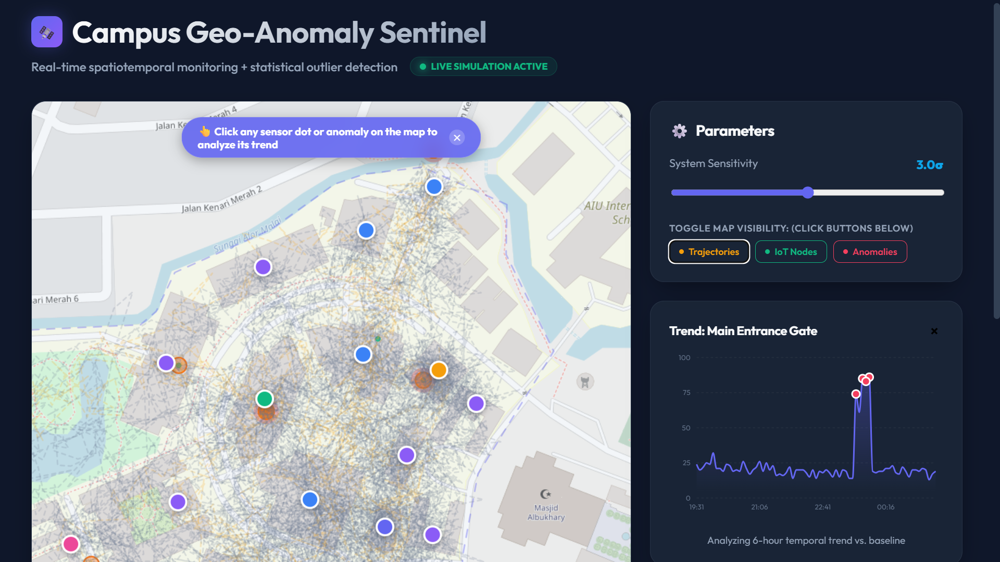
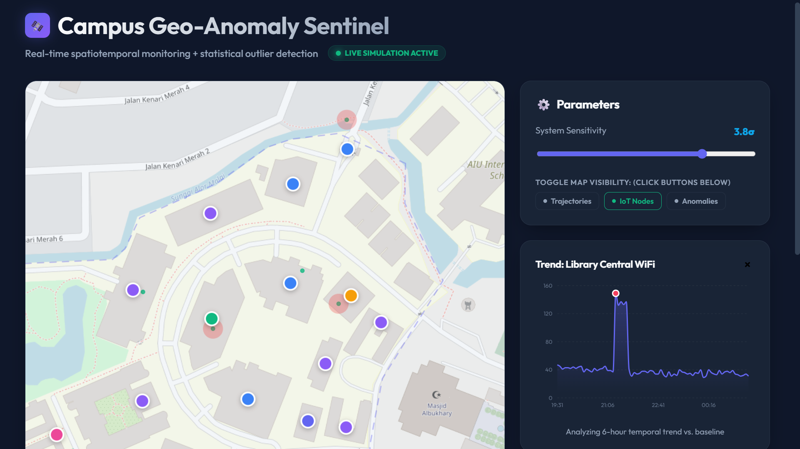
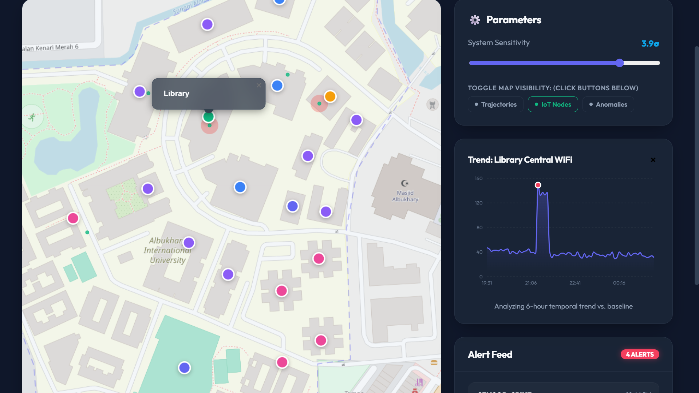

# Campus Geo-Anomaly Dashboard

**An interactive geospatial monitoring prototype for exploring simulated campus activity, IoT telemetry, and statistical anomalies on a real campus map.**

Built with **React, TypeScript, Leaflet, Recharts, Turf.js, and deterministic simulation**.

> **Data note:** all trajectories and sensor signals in this project are simulated locally. No real people are tracked and no live campus telemetry is collected.

---

## Product Preview

### Full Monitoring View



### Infrastructure-Focused View


### Anomaly-Focused View



### Sensitivity Tuning



---

## Overview

Campus Geo-Anomaly Dashboard is a front-end analytics prototype that explores how a campus could be monitored using **simulated movement trajectories and IoT-style sensor counts**.

The dashboard places synthetic activity on a map of **Albukhary International University (AIU)** and provides tools to investigate unusual sensor behaviour through:

- map-based trajectory visualisation;
- simulated Wi-Fi, BLE, and gate-count sensors;
- statistical spike detection;
- adjustable z-score sensitivity;
- ranked anomaly alerts;
- interactive sensor selection;
- six-hour time-series charts;
- layer visibility controls.

The project focuses on **interpretability**: an anomaly is not only flagged, but can also be inspected spatially on the map and temporally in a chart.

---

## What the Dashboard Simulates

The simulation generates a repeatable six-hour monitoring window.

### Campus activity

The simulator creates:

- **120 synthetic tours** across campus;
- student, staff, and visitor movement profiles;
- routes connecting known campus points of interest;
- small coordinate jitter to avoid perfectly identical paths.

### Sensor network

Six simulated sensors are anchored near campus locations:

| Sensor Type | Example Location |
| --- | --- |
| Gate count | Main Entrance |
| Wi-Fi count | Library |
| Wi-Fi count | Academic area |
| BLE count | Cafeteria |
| BLE count | Hostel zone |
| Wi-Fi count | Administration area |

Sensor positions include approximately **10 m of positional jitter** to represent installation variation.

### Telemetry

Sensor events are generated every **5 minutes**.

The baseline signal changes over the simulated day using time-of-day activity patterns, plus noise.

The simulator deliberately injects several temporary spike windows so the anomaly-detection interface can be demonstrated consistently.

---

## Anomaly Detection

The current implemented detector focuses on **sensor spikes**.

For each sensor, the dashboard calculates its empirical mean and standard deviation over the simulated monitoring window.

The z-score for an observation is:

```text
z = (x - μ) / σ
```

where:

- `x` = observed sensor value;
- `μ` = mean value for that sensor;
- `σ` = standard deviation.

An event is flagged when:

```text
z ≥ threshold
```

The default threshold is **3.0σ**, and the interface allows the user to adjust sensitivity from **1.5σ to 4.5σ**.

A higher threshold produces fewer, more extreme alerts. A lower threshold makes the detector more sensitive.

---

## Investigation Workflow

```text
Synthetic campus activity
          │
          ▼
Simulated sensor events
          │
          ▼
Per-sensor baseline statistics
          │
          ▼
Z-score anomaly detection
          │
          ▼
Map anomaly markers
          │
          ├───────────────┐
          ▼               ▼
 Ranked alert feed    Sensor selection
                          │
                          ▼
                   6-hour trend chart
                          │
                          ▼
                 Investigate the spike
```

The same anomaly can therefore be explored in both **space** and **time**.

---

## Key Features

### Interactive campus map

Built with Leaflet / React Leaflet and OpenStreetMap tiles.

The map displays:

- AIU campus boundary;
- points of interest;
- simulated movement trajectories;
- sensor nodes;
- injected spike windows;
- detected anomaly markers.

### Layer controls

Users can independently show or hide:

- trajectories;
- IoT nodes;
- anomalies.

This helps reduce visual clutter during investigation.

### Sensitivity control

The z-score threshold can be adjusted directly from the dashboard to see how anomaly volume changes.

### Alert feed

Detected anomalies are ranked and displayed in an alert panel.

Selecting an alert can:

- focus the map on the anomaly;
- highlight the selected event;
- load the associated sensor telemetry.

### Sensor trend analysis

Selecting a sensor opens a Recharts time-series view showing the previous six hours of simulated telemetry.

Detected anomaly points are highlighted directly on the chart.

---

## Architecture

```text
React + TypeScript
       │
       ├── Campus UI / controls
       │
       ├── Leaflet geospatial map
       │
       ├── Recharts telemetry chart
       │
       ▼
Deterministic simulation layer
       │
       ├── campus tours
       ├── sensor network
       ├── 5-minute telemetry
       └── injected spike windows
       │
       ▼
Statistical anomaly detector
       │
       └── per-sensor z-score
       │
       ▼
Map markers + alert feed + chart
```

This project is fully client-side; there is no production backend or live sensor ingestion layer.

---

## Tech Stack

| Area | Technologies |
| --- | --- |
| Frontend | React 19, TypeScript, Vite |
| Mapping | Leaflet, React Leaflet |
| Geospatial utilities | Turf.js |
| Charts | Recharts |
| Time formatting | date-fns |
| Basemap | OpenStreetMap |
| Detection | Statistical z-score |
| Data source | Deterministic local simulation |

---

## Repository Structure

```text
src/
├── app/
│   └── AppShell.tsx
├── components/
│   ├── charts/
│   │   └── SensorChart.tsx
│   └── map/
│       └── CampusMap.tsx
├── data/
│   └── campus.ts
├── ml/
│   └── anomaly.ts
├── sim/
│   └── simulate.ts
├── App.tsx
├── index.css
├── main.tsx
└── types.ts
```

---

## Run Locally

```bash
git clone https://github.com/Leroy-laboe/campus-geo-anomaly-dashboard.git
cd campus-geo-anomaly-dashboard
npm install
npm run dev
```

To create a production build:

```bash
npm run build
```

---

## Project Scope

This is a **simulation and analytics prototype**, not a deployed surveillance system.

The repository intentionally demonstrates:

- synthetic trajectory generation;
- geospatial visualisation;
- statistical anomaly detection;
- interactive investigation workflows;
- dashboard design for monitoring use cases.

It does **not** claim to process real student movement, real Wi-Fi logs, or live security data.

---

## Limitations

- Current anomaly detection uses a simple statistical baseline rather than a learned model.
- Sensor behaviour is synthetic and intentionally includes injected spikes.
- Simulated trajectories approximate movement between campus points of interest.
- The system has no real-time backend or physical sensor integration.
- A production deployment would require calibration, data governance, consent, access control, and privacy safeguards.

---

## Possible Extensions

Future work could include:

- streaming telemetry ingestion;
- persistent event storage;
- spatial hotspot detection;
- trajectory-deviation detection;
- learned anomaly models;
- role-based operational dashboards;
- privacy-preserving aggregation;
- alert acknowledgement and incident workflows.

---

## Author

**Leroy Nyasha Mangwarara**

Computer Science · Data Science · Software Engineering · Applied AI

[GitHub](https://github.com/Leroy-laboe) · [LinkedIn](https://www.linkedin.com/in/leroy-nyasha-mangwarara-86185a302/) · [Email](mailto:mangwararaleroy@gmail.com)
